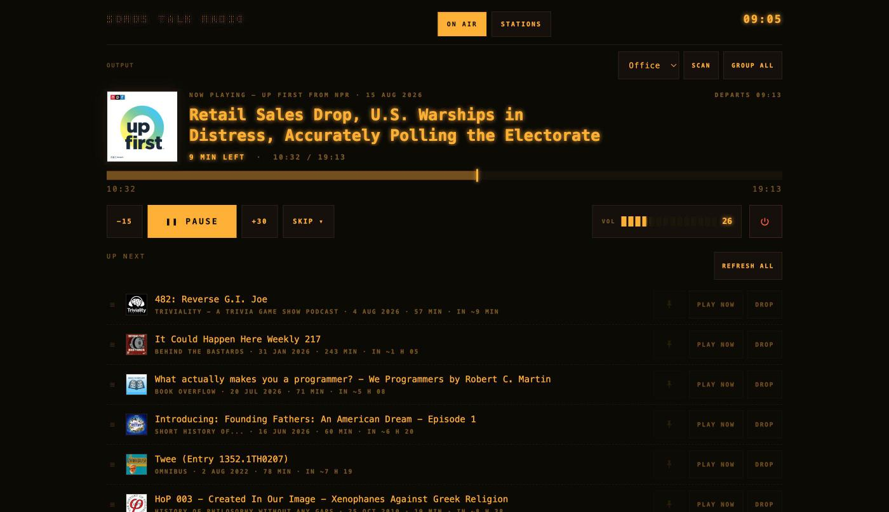
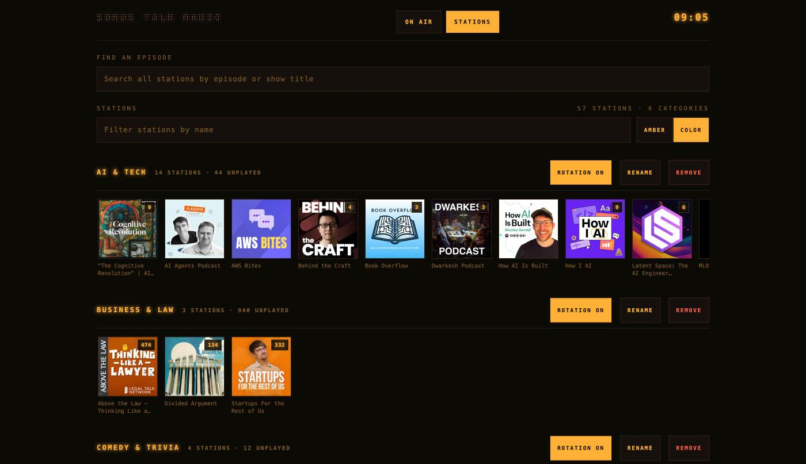
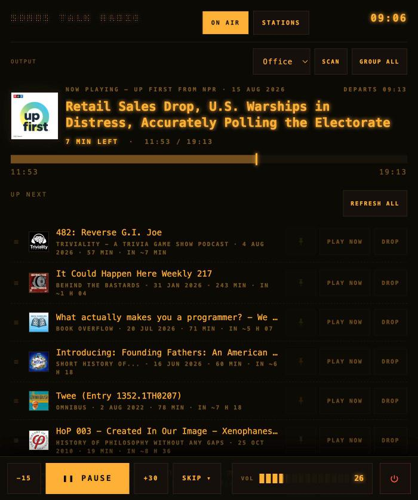

# Sonos Talk Radio

A self-hosted podcast DJ for your Sonos system. Add your science, history, and
philosophy shows plus 2–3 news feeds, press **On air**, and it programs the
speakers like a personal talk-radio station — forever.

## The three DJ rules

1. **Random show rotation.** The DJ picks a random *show*, not a random
   episode, and won't repeat a show while another has unplayed episodes.
   Switch a whole category's rotation off — from the *In rotation* row on
   *On air*, or the category header on *Stations* — without pausing or
   removing its stations. Force-play (*Play next*, *Play now*) ignores
   rotation settings, and an episode already queued when you switch a
   category off still plays out.
2. **Multi-part episodes stay in order.** Shows set to *In order* play their
   oldest unplayed episode. Shows set to *Random* draw any unplayed episode,
   but an arc guard still applies: when a draw belongs to a multi-part story
   ("Part 3", "(2/4)", a trailing "II"), the story's oldest unplayed part
   plays first, so a series arrives 1 → 2 → 3. New shows are classified on
   add — declared serials and heavily numbered feeds start *In order* — and
   any show can be flipped from its card in Stations.
3. **News always plays first.** Feeds flagged "news" jump to the front of
   Up Next, oldest first. News older than 24 h (configurable) is dropped, so
   you never hear Tuesday's headlines on Thursday.

## What you need

- A Sonos speaker on the same LAN broadcast domain as the server. Discovery is
  SSDP multicast, so a VLAN or guest network between them breaks it; `SONOS_IP`
  is the escape hatch.
- Docker, or Python 3.12+.

## Quickstart — Docker (recommended)

    git clone https://github.com/jacquardlabs/talk-radio.git && cd talk-radio
    TZ=America/Chicago docker compose up -d --build

Open http://<server>:8080.

## Quickstart — plain venv

    python3.12 -m venv .venv && .venv/bin/pip install -r requirements.txt
    .venv/bin/python main.py

## First run

Two pages: **On air** (now-playing deck, transport, Up Next, wake alarms,
recently played) and **Stations** (the library — categories, episodes, back
catalog).

On-air controls: **Play/Pause**, −15/+30 seek, **Skip ▾** (*Defer* parks the
episode in Up Next and resumes it where it stopped, *Later* returns it to
rotation, *Done* retires it), volume, and a power switch. **Refresh all**
re-rolls the DJ's picks: pinned rows and the track on air stay, everything
else goes back in the pool. Up Next rows act too: drag the grip to reorder —
arrow keys move a focused grip, so it works without a pointer — the pin spares
a row from that re-roll, *Play now* interrupts immediately, and *Drop* returns
that episode to rotation for another day. A caret on the deck and on each Up
Next row opens that episode's notes when the feed publishes them.

The dashboard is an installable PWA — on a phone, *Add to Home Screen* opens it
standalone like a remote control. Under 760px the transport docks to the bottom
of the screen, thumb-height:

1. **Pick a speaker** — on *On air*, hit *Scan*. Tap a room's name to make it
   the one the DJ plays through. Each room's checkbox adds it to the group or
   drops it out; the room holding the queue is fixed on — switch rooms rather
   than unticking it. *Group all* adds every speaker.
2. **Add stations** — on *Stations*, search by podcast name, or toggle to
   *Paste URL* for feeds a directory search won't find. Check *news* for news
   feeds. Pick how much back catalog to include:
   - *New episodes only* — nothing until the next episode drops
   - *Latest episode* (default) — start from the newest
   - *Last N episodes* — the newest N
   - *Entire back catalog* — starts the show at episode 1

   Release the archive later with *Add back catalog*.
3. **Set wake times** — alarm-style rows (time + day chips), e.g. 08:00
   Mon–Fri and 10:00 Sat–Sun.
4. Press **ON AIR**.
5. **Manage episodes** — *Stations* is a record crate: category shelves of
   artwork tiles, each shelf header carrying that category's rotation toggle,
   badges showing unplayed counts, and an *Amber/Color* switch for the artwork
   treatment. Tap a tile for its station sheet — controls plus episode browser.
   The sheet leads with the show's description, and a caret on an episode row
   opens that episode's notes; both come from the feed, so a show that
   publishes none shows none. Release archived episodes singly (*Release*) or
   in batches (*Select*, then *Release selected (N)*). *Play next* queues an
   episode after the current track, *Play now* interrupts, and *Add to Up
   Next* queues it at the end of the line; all three work on any episode
   regardless of status, and turn the station on air if it is off. An episode
   whose title carries a part marker also offers *Queue series* — every
   unheard part of that story, appended in order. *Find an episode* searches
   every station by episode or show title; each station panel has a local
   search too.

## Configuration

| Env var | Default | Meaning |
|---|---|---|
| `DATA_DIR` | `./data` | SQLite + downloaded media live here |
| `DB_PATH` | `$DATA_DIR/radio.db` | SQLite file |
| `MEDIA_DIR` | `$DATA_DIR/media` | download-mode storage |
| `HOST` / `PORT` | `0.0.0.0` / `8080` | web bind |
| `SONOS_SPEAKER` | — | speaker name to prefer at discovery |
| `SONOS_IP` | — | skip discovery, use this IP |
| `TICK_SECONDS` | `15` | reconcile loop interval |
| `REFRESH_MINUTES` | `30` | feed refresh interval |
| `QUEUE_AHEAD` | `10` | tracks kept queued ahead of the needle |
| `NEWS_MAX_AGE_HOURS` | `24` | news older than this is skipped |
| `DOWNLOAD_MODE` | `0` | `1` = download & serve locally (see below) |
| `BASE_URL` | auto | how the speaker reaches this server |
| `GRACE_MINUTES` | `10` | wake-alarm catch-up window after downtime |
| `WARM_MINUTES` | `5` | how far ahead of an alarm its URLs are resolved |
| `TZ` | — | timezone wake alarms fire in (**set this in Docker**) |
| `USER_AGENT` | `SonosTalkRadio/1.0` | for feed/audio requests |

## Security

There is no authentication. The app binds `0.0.0.0` and every control is an
unauthenticated HTTP endpoint, so anyone who can reach the port owns your
speakers. That is the intended trade for a LAN appliance: **do not port-forward
it or expose it to the internet.** For access from outside, put it behind a VPN
(Tailscale, WireGuard) rather than opening the port.

It also runs Flask's development server — fine for a few LAN clients and one
speaker, not for real traffic. Both `DOWNLOAD_MODE` and the automatic proxy
below make that server the audio path, so whole episodes move through it while
you listen.

## Audio delivery

Episodes stream straight from the podcast CDN by default. Some CDNs
(token-guarded URLs, long redirect chains) won't play on Sonos. Set
`DOWNLOAD_MODE=1` and the app downloads each episode, serves it from `/media/`
with HTTP Range support — which is what makes Sonos seeking work on local
files — and deletes it once played. `BASE_URL` is auto-detected from the
server's LAN address as the speaker sees it; set it explicitly if detection
guesses wrong.

A third path engages on its own, without download mode and without a setting.
Sonos keeps only the first 1024 bytes of a queue item's URI, and some hosts
sign their URLs past that (the BBC's run over 2000 characters), so the speaker
would fetch a truncated link and get a 403. Any resolved URL over the limit is
handed to Sonos as `/stream/<id>.mp3` instead, and the app fetches the CDN and
pumps the body through, Range headers both ways so seeking still works. It
needs `BASE_URL` to be right for the same reason download mode does, and it
puts whole episodes through the development server — see Security.

## Wake schedule (and why TZ matters)

Alarms fire on **local time inside the container**, and containers default to
UTC. Pass `TZ` in compose or your 08:00 alarm rings at 08:00 UTC.

`WARM_MINUTES` before an alarm, the app resolves the URLs it is about to need,
cutting the wait at 08:00 from roughly 30 seconds of redirect chains to 2–3
seconds. That pass downloads and queues nothing.

Firing refreshes feeds first, so headlines published 20 minutes earlier are
included. If the station was paused mid-episode the night before, the morning
runs fresh news → the interrupted episode at its saved position → normal
rotation. If you were **already listening** when the alarm came due, it gathers
the speakers and leaves playback where it is, queueing the headlines as the
next track instead of restarting what you are in the middle of. `GRACE_MINUTES`
means a reboot at 08:03 still catches the 08:00 start, while a server down all
morning stays quiet at 3 pm.

## Transport API

Plain HTTP, so external automation works:

    curl -X POST http://server:8080/player/play

Actions: `play` `pause` `restart` `back_15` `fwd_30` `defer` `skip_later`
`skip_done` `stop` `group_all`.

## Troubleshooting

- **Discovery finds nothing** — the container must share the LAN
  (`network_mode: host`), or set `SONOS_IP` to skip discovery.
- **An episode won't play, or instantly skips** — that CDN doesn't stream to
  Sonos; try `DOWNLOAD_MODE=1`.
- **Alarms fire at odd hours** — `TZ` isn't set in the container.
- **Someone started Spotify** — the DJ notices its queue is gone and stands
  down; press ON AIR to take back over.

## Development

    python3.12 -m venv .venv
    .venv/bin/pip install -r requirements-dev.txt
    .venv/bin/python -m pytest

389 tests, no network and no speaker required: Sonos is faked at the
`sonos_ctl` seam (`tests/fake_player.py`) and feeds come from fixtures.

`main.py` starts two threads — the DJ tick loop and the feed refresher — plus
Flask. `dj.py` holds the programming rules, `db.py` all SQLite access,
`feeds.py` RSS ingest, `audio.py` URL resolution, `sonos_ctl.py` the speaker
adapter, `web.py` the routes. Design notes for each feature live in
`docs/design/`.

`make deploy DEPLOY_HOST=you@server` ships the committed tree to a home server
over SSH and rebuilds the container there.

## License

MIT — see [LICENSE](LICENSE).
